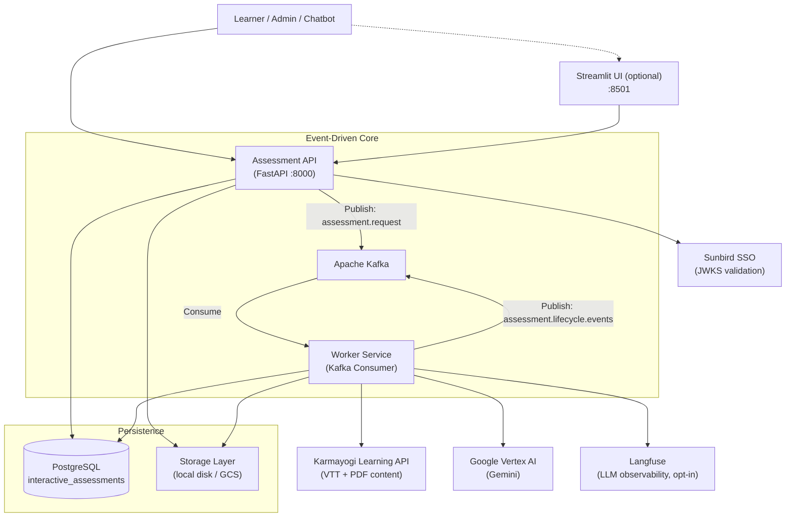
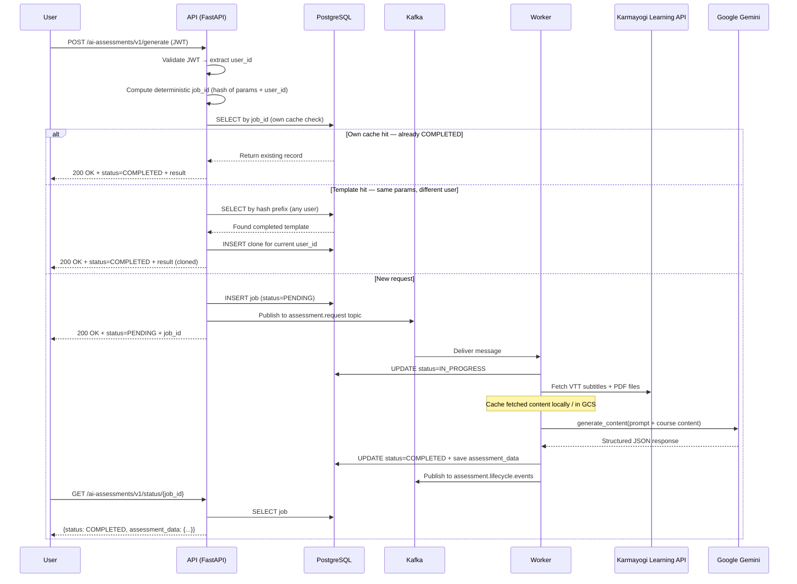

# Architecture — AI Assessment Service

Technical reference for the assessment generation service. Covers system context, request flow, core logic components, storage, observability, and deployment.

---

## 1. System Context

The service is a microservice operating within the Karmayogi government learning platform. It exposes a REST API consumed by the platform's web UI, chatbot, and admin portal.



**Key separation**: The API never calls the LLM. All Google Gemini calls happen exclusively in the Worker. The API's job is to validate, persist, enqueue, and serve.

---

## 2. End-to-End Request Flow

Assessment generation is fully asynchronous. The API responds in under 100ms; clients poll for the result.

**Every `/generate` response is HTTP `200`** — the `status` field (`PENDING` / `IN_PROGRESS` / `COMPLETED`) tells the client what happened, not the status code. A job that is already running returns `200` with `status: IN_PROGRESS` and no payload.



**Batching note**: the diagram shows one `Worker->>Gemini` call per job. For assessments whose requested question count exceeds `QUESTION_BATCH_SIZE` (default 25), the Worker instead makes several Gemini calls one after another, merged before `status=COMPLETED` is written — see [4.7 Batched Generation](#47-batched-generation-for-large-assessments).

---

## 3. Why API and Worker are Separate Processes

LLM generation takes 30 seconds to 5 minutes. If the API itself called Gemini, HTTP requests would time out and any API pod restart would silently drop in-flight jobs.

The Kafka queue decouples them:

| Property | Benefit |
|---|---|
| API returns instantly | Client receives `job_id` in <100ms; no timeout |
| Worker is independent | Crashes and restarts without affecting API |
| Kafka retains messages | Worker restart picks up exactly where it left off |
| Independent scaling | Scale Worker pods without touching API pods |
| LLM isolation | API never imports `google-genai`; Worker never serves HTTP |

In Kubernetes, API and Worker run as **separate Deployments** with separate Docker images (`Dockerfile` vs `DockerfileWorker`).

---

## 4. Core Logic: Generator & Prompt Engineering

`src/assessment/generator.py` is the most complex file. It handles the full LLM interaction.

### 4.1 Content Aggregation

For each course ID:
1. `fetcher.py` calls the Karmayogi Search API (`search_content`) to get the course node and its metadata (name, description, learning objectives)
2. For each video found on that node, calls the Karmayogi Learning AI Transcoder endpoint (`TRANSCODER_STATS_URL`) to retrieve VTT transcript download URLs
3. Downloads VTT subtitle files and any PDF handouts
4. Stores fetched content to disk (or GCS) — cached permanently so re-fetches are skipped on future jobs

**Fallback**: If a course's local content folder is missing when generation runs — typically because the Search API step failed to find or fetch that course — and `course_names` was provided in the request, the caller-supplied name is injected into the metadata so history never shows `N/A`.

### 4.2 Prompt Structure

The final prompt sent to Gemini has three layers:

```
┌─────────────────────────────────────────────────────────┐
│  System Prompt  (from prompts.yaml)                      │
│  • Role: Senior Instructional Designer                   │
│  • Anti-hallucination rules (strictly anchor to content) │
│  • Output schema instructions                            │
├─────────────────────────────────────────────────────────┤
│  KCM Context  (from Gemini Context Cache)                │
│  • 109 Karmayogi Competency Model definitions            │
│  • ~60k tokens — cached; NOT re-sent per request         │
├─────────────────────────────────────────────────────────┤
│  User Context  (built per request)                       │
│  • Extracted VTT text + PDF text per course              │
│  • Assessment config: type, difficulty, language         │
│  • Bloom's distribution map (level → assigned count)     │
│  • Question type counts                                  │
│  • Additional instructions (if any)                      │
└─────────────────────────────────────────────────────────┘
```

### 4.3 Bloom's Taxonomy Distribution

The user specifies a percentage per Bloom's level (must sum to 100). The generator distributes these across all active question types using a **proportional round-robin** algorithm:

1. Convert percentages → integer counts using the largest-remainder method (ensures exact total)
2. Build a shuffled pool of level labels sized to `total_questions`
3. Shuffle all question-type slots and zip them with the pool

No per-type ceilings exist — only the user's percentage and the total question count determine the distribution.

### 4.4 Gemini Context Caching (KCM)

The 109 KCM competency definitions (~60k tokens) are uploaded to Gemini's context cache at Worker startup. Each LLM call connects to the active cache ID instead of re-sending the full KCM text. This reduces per-request token costs and latency significantly.

### 4.5 Assessment Types

| Type | Content Source | KCM Required | Notes |
|---|---|---|---|
| `practice` | Course VTT/PDF | No | Single course reinforcement |
| `final` | Course VTT/PDF | No | Summative / certification |
| `comprehensive` | Multiple courses | No | Supports per-course weightage |
| `standalone` | Uploaded PDF/VTT | No | No course ID required |
| `competency` | Optional | Yes | Purely KCM-aligned; works with or without course content |

### 4.6 Question Types

| Code | Type | Notes |
|---|---|---|
| `mcq` | Multiple Choice | 4 options, one correct |
| `ftb` | Fill in the Blank | Exact answer phrase |
| `mtf` | Match the Following | Uses `matching_context` not `question_text` |
| `multichoice` | Multiple Selection | Multiple correct options |
| `truefalse` | True / False | Binary |

### 4.7 Batched Generation for Large Assessments

When the requested per-type question counts sum to more than `QUESTION_BATCH_SIZE` (default 25, see `config.py`), `generator.py` does not make a single LLM call. `_generate_in_batches` uses `batching.py` to split the request into several batches along the question-type axis — every batch still receives the full course content and the full KCM framework — and runs them **sequentially**, each one shown a compact list of the questions the earlier batches already produced so it can avoid restating them. The batches' question payloads are then combined into one assessment with `batching.merge_batches`.

The `blueprint` is authored by the **last** batch, which is the only call that has seen the whole assessment. That batch's prompt and response schema are identical to a single call's; the earlier batches have the blueprint section blanked and the key dropped from their schema. Afterwards `generator._recount_generated_fields` overwrites the three blueprint fields that can only be known by reading every generated question — `blooms_taxonomy_mapping`, `difficulty_distribution` and `unified_competency_map` — because those are tallies, and a model asked to count two hundred questions will not get them right.

### 4.8 Editing & Validation Modules

Beyond `generator.py`, the question-editing workspace is implemented across several modules:

| Module | Responsibility |
|---|---|
| `questions.py` | Question-level model helpers — the five canonical question-type buckets, the `question_order` sequence, and `normalize_assessment()`, which backfills `question_id`, `provenance` and option indexes on every read and write. |
| `editing.py` | The editing operations (`apply_question_edit`, `apply_question_add`, `apply_question_delete`, `apply_question_reorder`, `diff_assessments`) as pure functions that return an updated assessment plus the audit events the change produced. `AUDIT_EVENT_CODES` declares the six kinds of change the audit trail records. |
| `validation.py` | The validation gate — `validate_question`/`validate_assessment` block saving an invalid question. Errors are `code` + `field` + `question_id` + `params`, with no message string: the client owns the copy because it owns the user's language. `classify_option_change` tells an option re-sequencing from a real answer-key edit, and is here because the **audit trail** records that distinction. |
| `batching.py` | Sequential batch planning and merging for large assessments — `plan_batches` splits a request exceeding `QUESTION_BATCH_SIZE` into per-question-type batches (dividing Bloom's levels and course counts so the parts sum to the whole), `summarize_for_dedup` builds the already-generated list each later batch is shown, and `merge_batches` recombines the results into one payload. |

---

## 5. Storage Layer

`src/assessment/storage.py` abstracts file storage behind a common interface. The backend is selected by the `DOCUMENT_STORAGE_TYPE` env var.

```
get_storage_service()
    │
    ├── "local"  →  LocalStorageService
    │                Files stored in ./interactive_courses_data/
    │                Works for: single-node, Docker Compose
    │
    └── "gcs"    →  GCSStorageService
                     Files stored in a GCS bucket
                     Required for: Kubernetes (API and Worker on separate nodes)
```

Both API (for uploaded files) and Worker (for fetched course content) use the same abstraction.

### Course content cache layout

```
interactive_courses_data/            (INTERACTIVE_COURSES_PATH — also the local storage root)
│
├── {course_id}/                     ← root course node, written by fetcher.process_node()
│   ├── metadata.json                ← name, description, keywords, instructions (learning objectives)
│   ├── pdf_links.txt                ← "<pdf name> - <source url>" line per PDF attempted
│   ├── english_subtitles.vtt        ← every English VTT on this node, concatenated
│   ├── {sanitized pdf name}.pdf     ← one file per PDF found on this node
│   ├── {sanitized video name}/
│   │   └── en/
│   │       └── {original vtt filename}.vtt
│   └── {leaf_node_id}/              ← one per entry in the course's leafNodes[]
│       ├── metadata.json            ← same four file kinds repeat inside each leaf
│       ├── pdf_links.txt
│       ├── english_subtitles.vtt
│       └── {sanitized video name}/en/*.vtt
│
├── uploads/{job_id}/                ← files uploaded to /generate (API, local backend only)
└── storage_downloads/{job_id}/      ← Worker's local copy of those uploads
```

Two details that matter when debugging:

- **The generator only reads `english_subtitles.vtt` and `*.pdf`**, found by `rglob` across the whole course tree — the per-video `en/*.vtt` files are raw copies kept for reference and are never read during generation. Content is de-duplicated by MD5, so the same transcript appearing at both root and leaf level is only sent once.
- **Video folders are named after the sanitized video title**, not a resource ID, so renaming a video in Karmayogi produces a new folder on the next fetch.

In GCS mode, only the `{course_id}/` subtree is mirrored (under `GCS_COURSE_CONTENT_PREFIX`); uploads go to `GCS_UPLOAD_PREFIX` instead of `uploads/`.

If `metadata.json` already exists for a course, the fetch phase is skipped entirely on subsequent jobs.

---

## 6. Observability — Langfuse

`src/assessment/tracing.py` provides opt-in LLM observability. When `LANGFUSE_ENABLED=false` (default), the module is a zero-cost no-op — Langfuse is never imported.

### How it works

At Worker startup, `tracing.init()` monkeypatches `google.genai.models.AsyncModels.generate_content` and `embed_content`. Every LLM call anywhere in the codebase is automatically captured as a generation span — no per-call-site code needed.

```
Worker startup
    └── tracing.init()
            └── _instrument_genai()
                    └── Monkeypatch AsyncModels.generate_content
                                │
                                ▼ (per job)
                    set_identity(user_id, session_id)
                    with trace(name="assessment:{type}", ...):
                        await generate_assessment(...)
                                └── client.aio.models.generate_content(...)
                                        └── [auto-captured generation span]
                                                • model name
                                                • full prompt input
                                                • full JSON output
                                                • tokens: input/output/thinking/cached/total
                                                • latency
```

### What appears in Langfuse

| View | Content |
|---|---|
| **Traces** | One per assessment job (`assessment:practice`, etc.) with all LLM sub-calls nested |
| **Generation spans** | One per `generate_content` call — full prompt, full output, token counts |
| **Users** | Grouped by `user_id` from the Kafka payload |
| **Sessions** | Grouped by `{user_id}:{job_id}` — all LLM calls for one job |
| **Overview** | Aggregate latency, token volume, error rate over time |

### Token metering

Thinking tokens (from reasoning models) are folded into the `output` key for correct Langfuse cost calculation. Gemini bills thinking tokens at the output rate; sending them under a custom key would result in ~70% cost undercount. The `thinking` key is retained as a display-only field.

### Configuration

| Variable | Description |
|---|---|
| `LANGFUSE_ENABLED` | `true` to activate. Default `false`. |
| `LANGFUSE_PUBLIC_KEY` | Project public key |
| `LANGFUSE_SECRET_KEY` | Project secret key |
| `LANGFUSE_HOST` | Host URL (note: `LANGFUSE_HOST`, not `LANGFUSE_BASE_URL`) |
| `LANGFUSE_SAMPLE_RATE` | Fraction of traces to send (0.0–1.0) |

Only the **Worker** needs these vars. The API has no LLM calls and no Langfuse integration.

---

## 7. Database Design

Two tables, both created by `db.py` at startup, with additive `ADD COLUMN IF NOT EXISTS` migrations applied on every boot. Uses `asyncpg` for async PostgreSQL access with connection pooling (min 5 / max 20, 30-minute idle recycle).

### Schema — `interactive_assessments`

| Column | Type | Description |
|---|---|---|
| `course_id` | `TEXT` PRIMARY KEY | The job ID: `{base_id}_{param_hash}_{user_id}` — see note below |
| `user_id` | `TEXT` | Owner — extracted from JWT. Nullable, for v1 compatibility |
| `status` | `TEXT` | `PENDING` / `IN_PROGRESS` / `COMPLETED` / `FAILED` |
| `metadata` | `JSONB` | Config, course IDs, course names, content availability per course |
| `assessment_data` | `JSONB` | Full LLM output — blueprint + all question types |
| `token_usage` | `JSONB` | Token counts: prompt / candidates / thoughts / total |
| `error_message` | `TEXT` | Set on `FAILED` jobs |
| `created_at` | `TIMESTAMP` | Job creation time — timezone-naive, `DEFAULT NOW()` |
| `updated_at` | `TIMESTAMP` | Last status change time — timezone-naive |
| `version` | `INTEGER` | Assessment version — `1` on generation, +1 per saved edit. Drives optimistic concurrency |
| `ai_original_data` | `JSONB` | The pristine AI-generated assessment, never modified after generation — retained for audit |
| `edited_at` | `TIMESTAMP` | First human edit, or `NULL` if never edited |

### Schema — `interactive_assessment_audit`

One row per human change to an assessment, written inside the same transaction as the
assessment update. An audit row therefore exists if and only if the change was persisted.

A single save can produce several rows sharing one `assessment_version`: an answer-key
change writes Question Edit Saved and Correct Answer Changed, a mapping change writes
Question Edit Saved and Mapping Updated, and a reorder writes one Question Reordered event
per question that moved. The audit trail is the only place a user's changes are recorded;
nothing else about their activity is tracked.

| Column | Type | Description |
|---|---|---|
| `id` | `BIGSERIAL` PRIMARY KEY | Insertion order, which is also the chronological order |
| `job_id` | `TEXT` | The assessment this change belongs to |
| `assessment_version` | `INTEGER` | The version this change produced |
| `event_code` | `TEXT` | The six audit feeds: `TEL-03` Question Edit Saved · `TEL-05` Question Added · `TEL-06` Question Deleted · `TEL-07` Question Reordered · `TEL-10` Correct Answer Changed · `TEL-11` Mapping Updated. Stored as the code alone — the display name is the client's to supply. |
| `editor_id` | `TEXT` | The user who made the change |
| `question_id` | `TEXT` | Affected question |
| `question_type` | `TEXT` | `mcq` / `ftb` / `mtf` / `multichoice` / `truefalse` |
| `previous_position` | `INTEGER` | Position before the change |
| `new_position` | `INTEGER` | Position after the change |
| `changed_fields` | `JSONB` | `[{field, previous_value, new_value}]` |
| `original_question` | `JSONB` | The AI-generated question, captured on its first human edit |
| `question_snapshot` | `JSONB` | The question as it stands after this change |
| `details` | `JSONB` | Provenance transition, answer-key-changed flag, and similar context |
| `created_at` | `TIMESTAMP` | When the change was made |

Indexed on `(job_id, id)`.

### Editing workspace

The `questions` object the LLM returns is a dict of per-type buckets with no single
sequence, which the editing features need. Rather than flatten it and break every existing
consumer, `questions.py` keeps the buckets as the content store and adds a top-level
`question_order` array of question IDs as the authoritative sequence. Every question also
gains a unique `question_id` and a `provenance` of `ai_generated`, `ai_assisted` or
`human_authored`.

`normalize_assessment()` backfills all of this on read and on write, deterministically and
idempotently, so assessments generated before the editing workspace need no data
migration. Exporters iterate `iter_questions_in_order()`, which is what makes every
download reflect the saved sequence.

Writes go through `save_edited_assessment()`, a compare-and-swap on `version`:

```sql
UPDATE interactive_assessments
SET assessment_data = $4, version = version + 1, ...
WHERE course_id = $1 AND user_id = $2 AND version = $3 AND status = 'COMPLETED'
RETURNING version
```

If another writer committed since the caller read the row, zero rows match, nothing is
written, and the API returns `409` with the current version. The audit rows are inserted in
the same transaction, so a rejected or failed save leaves neither a partial assessment nor
an orphan audit row.

> **Column naming is legacy.** The primary key is called `course_id` but holds the full composite job ID, not a Karmayogi course ID; `get_user_assessments_history()` aliases it back with `SELECT course_id AS job_id`. The token column is `token_usage`, not `usage`. `GET /status/{job_id}` returns the raw row, so both names surface in that response.

### Caching and Clone Strategy

**Layer 1 — DB result cache**: A deterministic `job_id` is computed from a hash of all generation parameters (assessment type, difficulty, question counts, Bloom's config, prompt version, course IDs). If a `COMPLETED` job with this ID already exists for the user, it is returned immediately — no LLM call.

**Layer 2 — Cross-user clone**: If a `COMPLETED` job with the same hash prefix exists for *any* user, it is cloned to the requesting user's `job_id` instantly. The generation pipeline is bypassed entirely.

Only **never-edited** assessments (`version = 1 AND edited_at IS NULL`) qualify as clone templates. Cloning a reviewer-edited assessment would hand another user content carrying someone else's edits while presenting it as fresh AI output — wrong provenance, and no audit trail for the changes it contains.

### metadata JSONB structure

```json
{
  "courses": [{"name": "Course Name", "identifier": "do_xxx"}],
  "course_ids": ["do_xxx"],
  "course_names": ["Course Name"],
  "content_availability": {
    "do_xxx": {"has_vtt": true, "has_pdf": false}
  },
  "config": {
    "assessment_type": "practice",
    "difficulty": "intermediate",
    "total_questions": 10,
    "question_type_counts": {"mcq": 5, "ftb": 5},
    "language": "english",
    "enable_blooms": true,
    "blooms_config": {"remember": 20, "understand": 30, "apply": 30, "analyze": 20},
    "time_limit": null,
    "course_weightage": null,
    "competency_area": null,
    "competency_themes": null,
    "competency_sub_themes": null,
    "topic_names": null,
    "additional_instructions": null
  }
}
```

---

## 8. Kafka Topics

Two topics are used:

| Topic | Direction | Purpose |
|---|---|---|
| `assessment.request` | API → Worker | New job requests. Worker is the sole consumer. |
| `assessment.lifecycle.events` | Worker → Platform | Completion / failure notifications consumed by the broader Karmayogi platform. |

### Completion event payload

```json
{
  "event_type": "ASSESSMENT_GENERATION_COMPLETED",
  "job_id": "...",
  "user_id": "...",
  "status": "COMPLETED",
  "payload": {"course_ids": ["do_xxx"]}
}
```

---

## 9. Authentication

All API endpoints require a JWT in the `x-authenticated-user-token` header.

```
Request header
    └── x-authenticated-user-token: <JWT>
            │
            ▼  auth.py
        Fetch JWKS from Sunbird SSO
            └── Verify signature, expiry, issuer
                    └── Extract user_id (sub claim)
                            └── Check required role (AI_ASSESSMENT_CREATOR)
```

The `user_id` extracted here becomes the owner identity for all DB records and Langfuse traces. Bypass with `DISABLE_AUTH_VERIFICATION=true` (development only).

---

## 10. PDF Generation

WeasyPrint renders HTML+CSS to PDF, chosen specifically for Indian script support.

- **Font stack**: Bundled Noto Sans fonts (Malayalam, Tamil, Devanagari, Telugu, Kannada, Gujarati, Gurmukhi, Bengali) embedded via `@font-face` in the HTML template
- **Text shaping**: Pango (system library) handles correct ligature rendering for complex scripts — ReportLab lacks this support
- **Pipeline**: `assessment_data` JSON → HTML template → WeasyPrint → PDF bytes → HTTP response

---

## 11. Deployment

### Containers

| Image | Built from | Runs |
|---|---|---|
| API | `Dockerfile` (via `build.sh` / `Jenkinsfile`) | FastAPI + Uvicorn on port 8000 |
| Worker | `DockerfileWorker` (via `build-worker.sh` / `JenkinsfileWorker`) | Long-running Kafka consumer |
| UI | `ui/Dockerfile` | Streamlit on port 8501. Talks to API via internal Docker network. |

**Both images contain the same dependencies.** There is a single `pyproject.toml`, so `google-genai` and the Vertex AI SDK are installed in the API image too; `Dockerfile` and `DockerfileWorker` currently differ only in `EXPOSE` and `CMD`. The API/Worker separation is enforced at the **code** level — `api.py` never imports `generator.py` and makes no LLM calls — not by the image contents. Only the Worker needs Vertex AI credentials mounted at runtime.

### Local Docker Compose stack

```
docker-compose up --build
```

Starts: PostgreSQL + Kafka + Zookeeper + API + Worker + Streamlit UI.

Note that `docker-compose.yml` builds **both** the `api` and `worker` services from the root `Dockerfile` (`build: .`) and distinguishes them only by `command`. `DockerfileWorker` is used exclusively by the Jenkins/Kubernetes build path.

### Kubernetes

- API and Worker deployed as **separate Deployments**
- `DOCUMENT_STORAGE_TYPE=gcs` required — pods share files via GCS, not local disk
- Vertex AI credentials mounted as a Kubernetes Secret
- Kafka and PostgreSQL typically managed services (not in-cluster)

### Environment variables split

| Scope | Description |
|---|---|
| `[BOTH]` | `DATABASE_URL`, `KARMAYOGI_API_KEY`, `KAFKA_*`, `DOCUMENT_STORAGE_TYPE`, `GCS_*` |
| `[API only]` | `SUNBIRD_SSO_URL`, `SUNBIRD_SSO_REALM`, `REQUIRED_ROLE`, `DISABLE_AUTH_VERIFICATION`, `CLEANUP_*` |
| `[Worker only]` | `GOOGLE_PROJECT_ID`, `GOOGLE_LOCATION`, `GENAI_MODEL_NAME`, `GOOGLE_APPLICATION_CREDENTIALS`, `LEARNING_AI_BASE_URL`, `LANGFUSE_*` |

---

## 12. API Reference Summary

**Base path**: `/ai-assessments/v1`  
**Auth**: `x-authenticated-user-token: <JWT>` on all endpoints.

| Method | Endpoint | Behaviour |
|---|---|---|
| `POST` | `/generate` | Enqueues job. Always returns 200 — `status` is `PENDING` (new), `IN_PROGRESS` (already running) or `COMPLETED` (cached/cloned, payload under `result`) |
| `GET` | `/status/{job_id}` | Returns status + full result when COMPLETED |
| `POST` | `/questions/create/{job_id}` | Add a human-authored question |
| `POST` | `/questions/update/{job_id}` | Owner-only in-place edit of one question — `questionId` in body |
| `POST` | `/questions/delete/{job_id}` | Delete a question — `questionId` in body |
| `POST` | `/questions/order/{job_id}` | Reorder questions — `questionOrder` array in body |
| `GET` | `/audit/{job_id}` | Audit trail of all human changes |
| `PUT` | `/update/{job_id}` | Owner-only whole-blob edit of assessment_data (legacy) |
| `GET` | `/history` | All jobs by the authenticated user |
| `GET` | `/download/{job_id}?format=` | `csv` / `csv_basic` / `json` / `pdf` / `docx` — all built from the persisted final assessment |

All editing endpoints validate before writing, bump `version`, and record audit rows.

They persist and audit; they do not present. No endpoint returns impact warnings, a
confirmation preview, screen-reader copy or an error sentence — those are client
concerns, computable from the before-state the client already rendered. The API surface
is correspondingly narrow: one input form per operation, and machine-readable output.

### Path shape and the gateway constraint

Every path is a static verb prefix followed by `job_id` as the single trailing segment,
because the fronting Kong `API` entity (Kong 0.10–0.14: `uris` / `upstream_url` /
`strip_uri`) can only prefix-match. With `strip_uri: true` Kong strips the matched
prefix and appends the rest of the path verbatim to `upstream_url`; it cannot reorder
segments, and it cannot express a path parameter followed by further segments. A route
like `/assessments/{job_id}/questions/{question_id}` is therefore unroutable there.

Consequences baked into the design:

- The verb segment precedes `job_id`, so a job id can never be mistaken for a route name.
- There is **no** bare `/questions` route — on a longest-prefix router it would shadow
  `/questions/create`, `/questions/update`, `/questions/delete` and `/questions/order`.
- `PATCH`, `PUT` and `DELETE` all became `POST`, since the identifiers they used to carry
  in the path now travel in the body, and a `GET` or `DELETE` must not carry a body.
- Request bodies use the Sunbird envelope `{"request": {...}}` with camelCase fields;
  snake_case is accepted as an alias. Responses are unwrapped, as elsewhere in this service.

Validation of the relocated identifiers preserves the previous status codes: a missing or
malformed `questionId` is a `400` in the service's usual `{"detail", "errors"}` shape,
while a well-formed `questionId` naming no question stays a `404` (`question_not_found`),
exactly as when it arrived in the path.
`409` means a concurrent update was detected and nothing was written.

### Key generate parameters

```
multipart/form-data fields:
  assessment_type        → practice | final | comprehensive | standalone | competency
  difficulty             → beginner | intermediate | advanced
  total_questions        → integer
  question_type_counts   → JSON: {"mcq": 5, "ftb": 5, "mtf": 0, "multichoice": 0, "truefalse": 0}
  course_ids             → comma-separated course IDs (not required for standalone/competency)
  course_names           → comma-separated names matching course_ids order
  language               → english | hindi | tamil | telugu | kannada | malayalam | ...
  enable_blooms          → true | false
  blooms_config          → JSON: {"remember": 20, "understand": 30, "apply": 30, "analyze": 20}
  course_weightage       → JSON: {"do_A": 60, "do_B": 40}  (comprehensive only)
  competency_area        → string (competency type only)
  competency_themes      → comma-separated (competency type only)
  competency_sub_themes  → comma-separated (competency type only)
  time_limit             → minutes (optional)
  files                  → PDF/VTT uploads (standalone; or supplement for competency)
  force                  → true bypasses cache
```

### Output structure

Defined by `resources/schemas.json` and enforced by Gemini as `response_schema`. The two top-level keys are `blueprint` and `questions`.

```json
{
  "blueprint": {
    "assessment_scope_summary": "...",
    "courses_covered": ["Course Name"],
    "unified_competency_map": {
      "functional": ["Financial Acumen"],
      "behavioral": ["Accountability"],
      "domain": ["Public Finance"]
    },
    "module_structure": "...",
    "smart_learning_objectives": ["..."],
    "blooms_taxonomy_mapping": {"Remember": "20%", "Analyze": "30%"},
    "difficulty_distribution": "...",
    "question_type_suitability": "...",
    "evaluation_passing_policy": "...",
    "time_appropriateness_validation": "Validated for 30 minutes.",
    "prompt_version": "4.3",
    "api_version": "api/v1"
  },
  "questions": {
    "Multiple Choice Question": [
      {
        "question_id": "Q1",
        "question_type": "MCQ",
        "question_text": "...",
        "options": [
          {"text": "A", "index": 1},
          {"text": "B", "index": 2},
          {"text": "C", "index": 3},
          {"text": "D", "index": 4}
        ],
        "correct_option_index": 2,
        "difficulty_level": "Intermediate",
        "blooms_level": "Analyze",
        "relevance_percentage": 95,
        "course_name": "...",
        "answer_rationale": {
          "correct_answer_explanation": "...",
          "why_factor": "...",
          "logic_justification": "..."
        },
        "reasoning": {
          "learning_objective_alignment": "...",
          "competency_alignment": {
            "kcm": {
              "competency_area": "...",
              "competency_theme": "...",
              "competency_sub_theme": "..."
            },
            "domain": "..."
          },
          "blooms_level_justification": "...",
          "difficulty_justification": "...",
          "question_type_rationale": "...",
          "assessment_type_relevance": "..."
        }
      }
    ],
    "FTB Question": [],
    "MTF Question": [],
    "Multi-Choice Question": [],
    "True/False Question": []
  }
}
```

**The five `questions` keys are exact strings** — `Multiple Choice Question`, `FTB Question`, `MTF Question`, `Multi-Choice Question`, `True/False Question`. Note how close `Multiple Choice Question` (single answer) and `Multi-Choice Question` (multiple answers) are; `exporters_csv_v2.py` distinguishes them by exact match, so client code must too.

Per-type differences from the MCQ shape above:

| Type | `question_type` | Answer fields |
|---|---|---|
| `Multiple Choice Question` | `"MCQ"` | `options[]` + `correct_option_index` (integer) |
| `Multi-Choice Question` | `"MULTICHOICE"` | `options[]` + `correct_option_index` (**array** of integers) |
| `FTB Question` | `"FTB"` | `correct_answer` (string); blanks appear as `___` in `question_text` |
| `MTF Question` | `"MTF"` | `matching_context` + `pairs[]` of `{left, right}` — **no `question_text`** |
| `True/False Question` | `"TRUEFALSE"` | `correct_answer`, either `"True"` or `"False"` |

Every type carries `question_id`, `question_type`, `reasoning`, `relevance_percentage` and `answer_rationale` as required fields; `difficulty_level`, `blooms_level` and `course_name` are optional. `relevance_percentage` sits at the **top level** of each question, not inside `reasoning`. Each entry in `options[]` carries its own `index`, and correctness is matched against that value — not the array position — so never assume the two agree.
