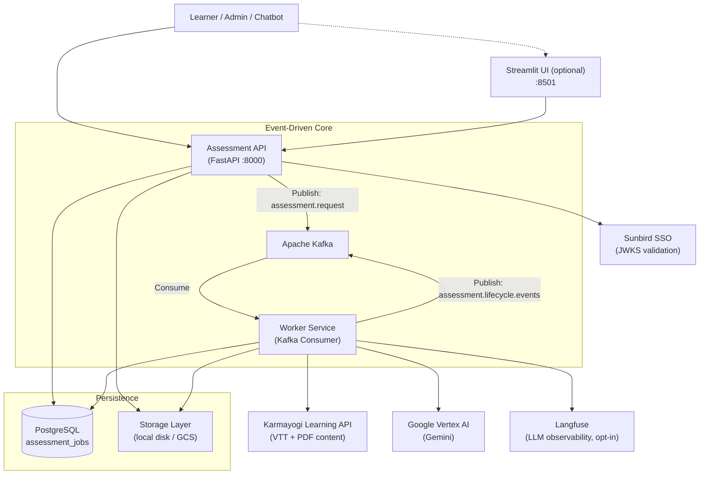

# Architecture — AI Assessment Service

Technical reference for the assessment generation service. Covers system context, request flow, core logic components, storage, observability, and deployment.

---

## 1. System Context

The service is a microservice operating within the Karmayogi government learning platform. It exposes a REST API consumed by the platform's web UI, chatbot, and admin portal.



**Key separation**: The API never calls the LLM. All Google Gemini calls happen exclusively in the Worker. The API's job is to validate, persist, enqueue, and serve.

---

## 2. End-to-End Request Flow

Assessment generation is fully asynchronous. The API responds in under 100ms; clients poll for the result.


---

## 3. Why API and Worker are Separate Processes

LLM generation takes 30 seconds to 5 minutes. If the API itself called Gemini, HTTP requests would time out and any API pod restart would silently drop in-flight jobs.

The Kafka queue decouples them:

| Property | Benefit |
|---|---|
| API returns instantly | Client receives `job_id` in <100ms; no timeout |
| Worker is independent | Crashes and restarts without affecting API |
| Kafka retains messages | Worker restart picks up exactly where it left off |
| Independent scaling | Scale Worker pods without touching API pods |
| LLM isolation | API never imports `google-genai`; Worker never serves HTTP |

In Kubernetes, API and Worker run as **separate Deployments** with separate Docker images (`Dockerfile` vs `DockerfileWorker`).

---

## 4. Core Logic: Generator & Prompt Engineering

`src/assessment/generator.py` is the most complex file. It handles the full LLM interaction.

### 4.1 Content Aggregation

For each course ID:
1. `fetcher.py` calls the Karmayogi Learning AI API to retrieve VTT transcript download URLs
2. Calls the Karmayogi Search API to get course metadata (name, description, learning objectives)
3. Downloads VTT subtitle files and any PDF handouts
4. Stores fetched content to disk (or GCS) — cached permanently so re-fetches are skipped on future jobs

**Fallback**: If a course returns 404 from the Learning API, and `course_names` was provided in the request, the caller-supplied name is injected into the metadata so history never shows `N/A`.

### 4.2 Prompt Structure

The final prompt sent to Gemini has three layers:

```
┌─────────────────────────────────────────────────────────┐
│  System Prompt  (from prompts.yaml)                      │
│  • Role: Senior Instructional Designer                   │
│  • Anti-hallucination rules (strictly anchor to content) │
│  • Output schema instructions                            │
├─────────────────────────────────────────────────────────┤
│  KCM Context  (from Gemini Context Cache)                │
│  • 110 Karmayogi Competency Model definitions            │
│  • ~60k tokens — cached; NOT re-sent per request         │
├─────────────────────────────────────────────────────────┤
│  User Context  (built per request)                       │
│  • Extracted VTT text + PDF text per course              │
│  • Assessment config: type, difficulty, language         │
│  • Bloom's distribution map (level → assigned count)     │
│  • Question type counts                                  │
│  • Additional instructions (if any)                      │
└─────────────────────────────────────────────────────────┘
```

### 4.3 Bloom's Taxonomy Distribution

The user specifies a percentage per Bloom's level (must sum to 100). The generator distributes these across all active question types using a **proportional round-robin** algorithm:

1. Convert percentages → integer counts using the largest-remainder method (ensures exact total)
2. Build a shuffled pool of level labels sized to `total_questions`
3. Shuffle all question-type slots and zip them with the pool

No per-type ceilings exist — only the user's percentage and the total question count determine the distribution.

### 4.4 Gemini Context Caching (KCM)

The 110 KCM competency definitions (~60k tokens) are uploaded to Gemini's context cache at Worker startup. Each LLM call connects to the active cache ID instead of re-sending the full KCM text. This reduces per-request token costs and latency significantly.

### 4.5 Assessment Types

| Type | Content Source | KCM Required | Notes |
|---|---|---|---|
| `practice` | Course VTT/PDF | No | Single course reinforcement |
| `final` | Course VTT/PDF | No | Summative / certification |
| `comprehensive` | Multiple courses | No | Supports per-course weightage |
| `standalone` | Uploaded PDF/VTT | No | No course ID required |
| `competency` | Optional | Yes | Purely KCM-aligned; works with or without course content |

### 4.6 Question Types

| Code | Type | Notes |
|---|---|---|
| `mcq` | Multiple Choice | 4 options, one correct |
| `ftb` | Fill in the Blank | Exact answer phrase |
| `mtf` | Match the Following | Uses `matching_context` not `question_text` |
| `multichoice` | Multiple Selection | Multiple correct options |
| `truefalse` | True / False | Binary |

---

## 5. Storage Layer

`src/assessment/storage.py` abstracts file storage behind a common interface. The backend is selected by the `DOCUMENT_STORAGE_TYPE` env var.

```
get_storage_service()
    │
    ├── "local"  →  LocalStorageService
    │                Files stored in ./interactive_courses_data/
    │                Works for: single-node, Docker Compose
    │
    └── "gcs"    →  GCSStorageService
                     Files stored in a GCS bucket
                     Required for: Kubernetes (API and Worker on separate nodes)
```

Both API (for uploaded files) and Worker (for fetched course content) use the same abstraction.

### Course content cache layout

```
interactive_courses_data/       (or GCS_COURSE_CONTENT_PREFIX in GCS)
├── {course_id}/
│   ├── metadata.json           ← course name, description, learning objectives
│   ├── {module_id}/
│   │   ├── handout.pdf
│   │   └── {resource_id}/
│   │       └── en/
│   │           └── transcript.vtt
└── storage_downloads/
    └── {job_id}/               ← standalone uploaded files (temp, cleaned after job)
```

If `metadata.json` already exists for a course, the fetch phase is skipped entirely on subsequent jobs.

---

## 6. Observability — Langfuse

`src/assessment/tracing.py` provides opt-in LLM observability. When `LANGFUSE_ENABLED=false` (default), the module is a zero-cost no-op — Langfuse is never imported.

### How it works

At Worker startup, `tracing.init()` monkeypatches `google.genai.models.AsyncModels.generate_content` and `embed_content`. Every LLM call anywhere in the codebase is automatically captured as a generation span — no per-call-site code needed.

```
Worker startup
    └── tracing.init()
            └── _instrument_genai()
                    └── Monkeypatch AsyncModels.generate_content
                                │
                                ▼ (per job)
                    set_identity(user_id, session_id)
                    with trace(name="assessment:{type}", ...):
                        await generate_assessment(...)
                                └── client.aio.models.generate_content(...)
                                        └── [auto-captured generation span]
                                                • model name
                                                • full prompt input
                                                • full JSON output
                                                • tokens: input/output/thinking/cached/total
                                                • latency
```

### What appears in Langfuse

| View | Content |
|---|---|
| **Traces** | One per assessment job (`assessment:practice`, etc.) with all LLM sub-calls nested |
| **Generation spans** | One per `generate_content` call — full prompt, full output, token counts |
| **Users** | Grouped by `user_id` from the Kafka payload |
| **Sessions** | Grouped by `{user_id}:{job_id}` — all LLM calls for one job |
| **Overview** | Aggregate latency, token volume, error rate over time |

### Token metering

Thinking tokens (from reasoning models) are folded into the `output` key for correct Langfuse cost calculation. Gemini bills thinking tokens at the output rate; sending them under a custom key would result in ~70% cost undercount. The `thinking` key is retained as a display-only field.

### Configuration

| Variable | Description |
|---|---|
| `LANGFUSE_ENABLED` | `true` to activate. Default `false`. |
| `LANGFUSE_PUBLIC_KEY` | Project public key |
| `LANGFUSE_SECRET_KEY` | Project secret key |
| `LANGFUSE_HOST` | Host URL (note: `LANGFUSE_HOST`, not `LANGFUSE_BASE_URL`) |
| `LANGFUSE_SAMPLE_RATE` | Fraction of traces to send (0.0–1.0) |

Only the **Worker** needs these vars. The API has no LLM calls and no Langfuse integration.

---

## 7. Database Design

Single table: `assessment_jobs`. Uses `asyncpg` for async PostgreSQL access with connection pooling.

### Schema

| Column | Type | Description |
|---|---|---|
| `job_id` | `TEXT` PRIMARY KEY | Deterministic: `{hash_of_params}_{user_id}` |
| `user_id` | `TEXT` | Owner — extracted from JWT |
| `status` | `TEXT` | `PENDING` / `IN_PROGRESS` / `COMPLETED` / `FAILED` |
| `metadata` | `JSONB` | Config, course IDs, course names, content availability per course |
| `assessment_data` | `JSONB` | Full LLM output — blueprint + all question types |
| `usage` | `JSONB` | Token counts: prompt / candidates / thoughts / total |
| `error_message` | `TEXT` | Set on `FAILED` jobs |
| `created_at` | `TIMESTAMPTZ` | Job creation time |
| `updated_at` | `TIMESTAMPTZ` | Last status change time |

### Caching and Clone Strategy

**Layer 1 — DB result cache**: A deterministic `job_id` is computed from a hash of all generation parameters (assessment type, difficulty, question counts, Bloom's config, prompt version, course IDs). If a `COMPLETED` job with this ID already exists for the user, it is returned immediately — no LLM call.

**Layer 2 — Cross-user clone**: If a `COMPLETED` job with the same hash prefix exists for *any* user, it is cloned to the requesting user's `job_id` instantly. The generation pipeline is bypassed entirely.

### metadata JSONB structure

```json
{
  "courses": [{"name": "Course Name", "identifier": "do_xxx"}],
  "course_ids": ["do_xxx"],
  "course_names": ["Course Name"],
  "content_availability": {
    "do_xxx": {"has_vtt": true, "has_pdf": false}
  },
  "config": {
    "assessment_type": "practice",
    "difficulty": "intermediate",
    "total_questions": 10,
    "question_type_counts": {"mcq": 5, "ftb": 5},
    "language": "english",
    "enable_blooms": true,
    "blooms_config": {"remember": 20, "understand": 30, "apply": 30, "analyze": 20},
    "time_limit": null,
    "course_weightage": null,
    "competency_area": null,
    "competency_themes": null,
    "competency_sub_themes": null,
    "topic_names": null,
    "additional_instructions": null
  }
}
```

---

## 8. Kafka Topics

Two topics are used:

| Topic | Direction | Purpose |
|---|---|---|
| `assessment.request` | API → Worker | New job requests. Worker is the sole consumer. |
| `assessment.lifecycle.events` | Worker → Platform | Completion / failure notifications consumed by the broader Karmayogi platform. |

### Completion event payload

```json
{
  "event_type": "ASSESSMENT_GENERATION_COMPLETED",
  "job_id": "...",
  "user_id": "...",
  "status": "COMPLETED",
  "payload": {"course_ids": ["do_xxx"]}
}
```

---

## 9. Authentication

All API endpoints require a JWT in the `x-authenticated-user-token` header.

```
Request header
    └── x-authenticated-user-token: <JWT>
            │
            ▼  auth.py
        Fetch JWKS from Sunbird SSO
            └── Verify signature, expiry, issuer
                    └── Extract user_id (sub claim)
                            └── Check required role (AI_ASSESSMENT_CREATOR)
```

The `user_id` extracted here becomes the owner identity for all DB records and Langfuse traces. Bypass with `DISABLE_AUTH_VERIFICATION=true` (development only).

---

## 10. PDF Generation

WeasyPrint renders HTML+CSS to PDF, chosen specifically for Indian script support.

- **Font stack**: Bundled Noto Sans fonts (Malayalam, Tamil, Devanagari, Telugu, Kannada, Gujarati, Gurmukhi, Bengali) embedded via `@font-face` in the HTML template
- **Text shaping**: Pango (system library) handles correct ligature rendering for complex scripts — ReportLab lacks this support
- **Pipeline**: `assessment_data` JSON → HTML template → WeasyPrint → PDF bytes → HTTP response

---

## 11. Deployment

### Containers

| Image | Built from | Runs |
|---|---|---|
| API | `Dockerfile` | FastAPI + Uvicorn on port 8000. No LLM dependencies. |
| Worker | `DockerfileWorker` | Long-running Kafka consumer. Includes `google-genai`, Vertex AI credentials. |
| UI | `ui/Dockerfile` | Streamlit on port 8501. Talks to API via internal Docker network. |

### Local Docker Compose stack

```
docker-compose up --build
```

Starts: PostgreSQL + Kafka + Zookeeper + API + Worker + Streamlit UI.

### Kubernetes

- API and Worker deployed as **separate Deployments**
- `DOCUMENT_STORAGE_TYPE=gcs` required — pods share files via GCS, not local disk
- Vertex AI credentials mounted as a Kubernetes Secret
- Kafka and PostgreSQL typically managed services (not in-cluster)

### Environment variables split

| Scope | Description |
|---|---|
| `[BOTH]` | `DATABASE_URL`, `KARMAYOGI_API_KEY`, `KAFKA_*`, `DOCUMENT_STORAGE_TYPE`, `GCS_*` |
| `[API only]` | `SUNBIRD_SSO_URL`, `SUNBIRD_SSO_REALM`, `REQUIRED_ROLE`, `DISABLE_AUTH_VERIFICATION`, `CLEANUP_*` |
| `[Worker only]` | `GOOGLE_PROJECT_ID`, `GOOGLE_LOCATION`, `GENAI_MODEL_NAME`, `GOOGLE_APPLICATION_CREDENTIALS`, `LEARNING_AI_BASE_URL`, `LANGFUSE_*` |

---

## 12. API Reference Summary

**Base path**: `/ai-assessments/v1`  
**Auth**: `x-authenticated-user-token: <JWT>` on all endpoints.

| Method | Endpoint | Behaviour |
|---|---|---|
| `POST` | `/generate` | Enqueues job; returns 202 (new) or 200 (cached/cloned) |
| `GET` | `/status/{job_id}` | Returns status + full result when COMPLETED |
| `PUT` | `/update/{job_id}` | Owner-only edit of assessment_data |
| `GET` | `/history` | All jobs by the authenticated user |
| `GET` | `/download/{job_id}?format=` | `csv` / `csv_basic` / `json` / `pdf` / `docx` |

### Key generate parameters

```
multipart/form-data fields:
  assessment_type        → practice | final | comprehensive | standalone | competency
  difficulty             → beginner | intermediate | advanced
  total_questions        → integer
  question_type_counts   → JSON: {"mcq": 5, "ftb": 5, "mtf": 0, "multichoice": 0, "truefalse": 0}
  course_ids             → comma-separated course IDs (not required for standalone/competency)
  course_names           → comma-separated names matching course_ids order
  language               → english | hindi | tamil | telugu | kannada | malayalam | ...
  enable_blooms          → true | false
  blooms_config          → JSON: {"remember": 20, "understand": 30, "apply": 30, "analyze": 20}
  course_weightage       → JSON: {"do_A": 60, "do_B": 40}  (comprehensive only)
  competency_area        → string (competency type only)
  competency_themes      → comma-separated (competency type only)
  competency_sub_themes  → comma-separated (competency type only)
  time_limit             → minutes (optional)
  files                  → PDF/VTT uploads (standalone; or supplement for competency)
  force                  → true bypasses cache
```

### Output structure

```json
{
  "blueprint": {
    "assessment_scope_summary": "...",
    "smart_learning_objectives": ["..."],
    "unified_competency_map": {
      "functional": ["Financial Acumen"],
      "behavioral": ["Accountability"]
    },
    "blooms_taxonomy_mapping": {"Remember": "20%", "Analyze": "30%"},
    "time_appropriateness_validation": "Validated for 30 minutes."
  },
  "questions": {
    "Multiple Choice Question": [
      {
        "course_name": "...",
        "question_text": "...",
        "options": [{"text": "A"}, {"text": "B"}, {"text": "C"}, {"text": "D"}],
        "correct_option_index": 1,
        "blooms_level": "Analyze",
        "answer_rationale": {
          "correct_answer_explanation": "...",
          "why_factor": "...",
          "logic_justification": "..."
        },
        "reasoning": {
          "learning_objective_alignment": "...",
          "competency_alignment": {
            "kcm": {"competency_area": "...", "competency_theme": "...", "sub_theme": "..."},
            "domain": "..."
          },
          "blooms_level_justification": "...",
          "relevance_percentage": 95
        }
      }
    ],
    "FTB Question": [...],
    "MTF Question": [...],
    "Multiple Select Question": [...],
    "True/False Question": [...]
  }
}
```
